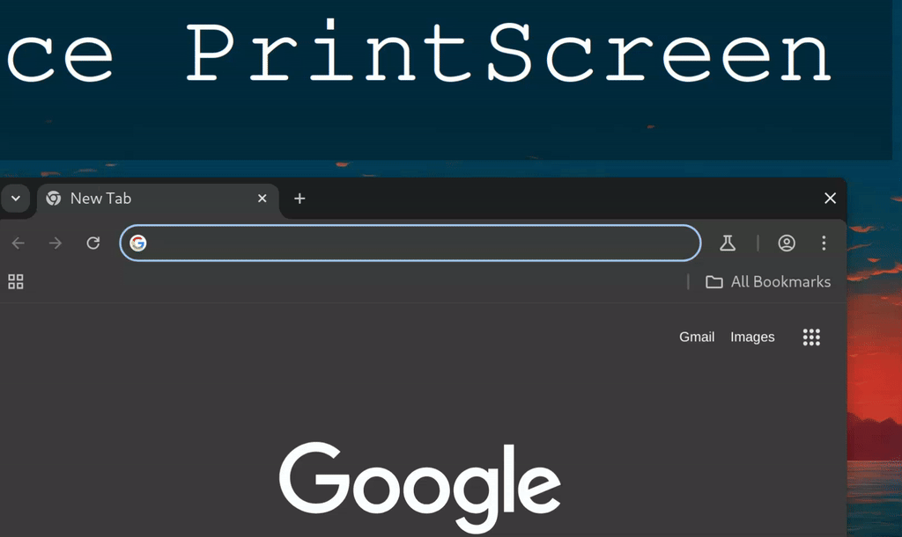
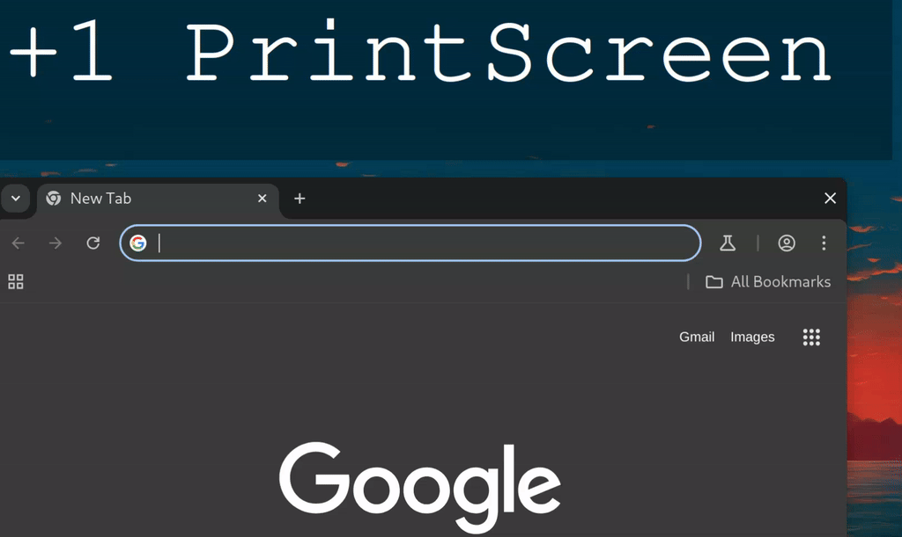
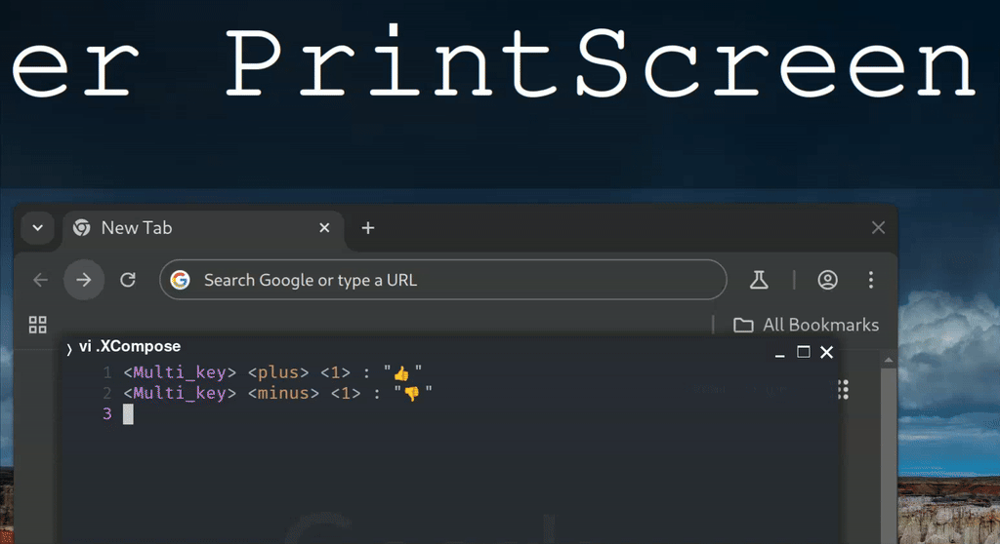

+++
date = '2025-01-02T13:29:00-05:00'
draft = false
title = 'What is an Input Method Editor?'
diagram = true
series = ['ime']
tags = ['ime']
+++

I've been working on chromium input method editor integration for linux wayland at Igalia over the past several months, and I thought I'd share some insights I've gained along the way and some highlights from my work.

This is the first in a series of blog posts about input method editors, or IME in short. Here I will try to explain what an IME really is at a high level before diving deeper into some of the technical details of IME support in linux and chromium in upcoming posts.

_**Disclaimer**: My understanding is limited to the semantics of implementing IME support in chromium running in a Linux-based desktop operating system, and I am by no means an IME expert or a linguist for that matter. This is only meant to serve as a precursor to topics in upcoming blog posts. For further reading about IME in general, see the links at the bottom._

## Let's understand the basics

If you've ever typed in a language other than English, chances are you've used an IME. Also, if by any chance you've used a cellphone after 2007, there is a very high probability that you've used an IME.

In short, an IME provides typing capabilities beyond what is normally possible with a standard physical keyboard. It can be built into the operating system or as is the case in linux desktop, available as a separate piece of software.

An IME is needed when some additional processing needs to occur on raw input events, like keystrokes from a physical keyboard, before sending the synthesized event to the application.

Let's take a look at some examples.

### Languages with large character sets

Many languages, most notably the [CJK languages](https://en.wikipedia.org/wiki/CJK_characters), have character sets that exceed the number of characters that can be effectively represented within a physical keyboard.

So characters in those languages need to be "composed" using sequences of keystrokes in a regular keyboard. And this is exactly where an IME comes in. It is able to translate those sequences into characters in various languages.

As an example, some European languages require diacritics (á, ö, ç). While some of those characters may be available as keys in a keyboard or by using a keyboard layout for that language, additional characters can be entered using [dead key](https://en.wikipedia.org/wiki/Dead_key) and [compose key](https://en.wikipedia.org/wiki/Compose_key) sequences with the help of an IME:
- With keyboard layout set to German, entering `´` (dead key) followed by `a` produces `á`.

- With a compose key configured, typing `Compose key`, `"` and `u` produces `ü`.

Then there are IMEs for languages like Japanese that make it possible to enter text phonetically using the English keyboard.


{.img-decorated}

In the above animation the sentence `寿司はおいしいです` (means "sushi is delicious") is typed as follows:
- The [romanized](https://en.wikipedia.org/wiki/Romanization) phonetic spelling for each Japanese character in the sentence is typed: `su shi ha oi shi i de su`. It's important to enter the entire sentence at once for the IME to make an initial prediction for the composition text: `すしはおいしいです`.
- After that parts of the sentence can be edited by the user using suggested alternatives from the IME. In this case the initial two characters representing "sushi", are changed from the hiragana representation `すし` to the Kanji representation `寿司` from the candidate selection popup.
- Finally, after making all adjustments the user hits enter, which concludes the composition and the text is "committed".

### Special Characters

Similar to composing characters in some languages, special characters like symbols (©, ™) and emojis (🫎, 🦥) can be composed using key combinations as well, usually beginning with the [Compose key](https://en.wikipedia.org/wiki/Compose_key).

Some common sequences are supported by many IMEs, e.g. `Compose key + C + O` produces `©`:


{.img-decorated}

Custom sequences can be configured as well, e.g. `Compose key + <plus> + 1` to produce `👍`:


{.img-decorated}

### Typing Assistance

Features like autocorrect and suggestions can be implemented by an application such as a word processor or a predictive search UI. But they may also be provided by an IME so that those features can be used in any application.

### When there are no buttons to press

A virtual or on screen keyboard, used in touch screen devices, and desktop for accessibility, is an IME which produces text after processing touch input or mouse clicks within dynamic on-screen layouts and may include features to enhance the typing experience.

There are other IMEs that can produce text from speech and handwriting.

## IME APIs

```
     +----------------+
     |   Application  |
     +----------------+
            / \
             |   IME API
             |
     +-------|--------+
     |      \ /       |
     |    +-----+     |
     |    | IME |     |
     |    +-----+     |
     |                |
     |    Platform    |
     +----------------+
```

In order for an application to receive processed data from an IME, both the application and the IME need to adhere to a shared set of rules specified by an API or set of APIs, that may be exposed by the platform or directly by the IME.

An API may provide the following to the application:
- Composition text: Also called "preedit", this represents the text that is currently being composed. The composition text maybe accompanied by styling information for the current composition or parts of it, e.g. underline, color and thickness.
- Commit text: This is the text that gets accepted when the current composition concludes.
- Delete surrounding text: Used to delete some of the text around the cursor, e.g. for autocorrect or backspace in on-screen keyboards.

An application may use the API to provide some data to the IME as well, for example:
- Input type: The type of content the current input field contains, e.g. text, number, password etc.
- Surrounding text: Represents the data around the cursor, meant to provide additional context to the IME, e.g. for accurate composition or suggestions.

IME APIs are natively available on platforms like [Windows](https://learn.microsoft.com/en-us/windows/win32/intl/input-method-manager), [Mac](https://developer.apple.com/documentation/inputmethodkit) and [Android](https://developer.android.com/develop/ui/views/touch-and-input/creating-input-method#IMEAPI).

On Linux desktop there are several different APIs available, and that will be the topic of discussion in the next blog post.

## IME and browsers

Browsers implement IME APIs available on each platform to support IME input in fields like the address bar or the HTML input field within a webpage.

Browsers also need to expose IME APIs to web applications. See W3C spec for [composition events](https://www.w3.org/TR/uievents/#events-compositionevents) and [IME](https://www.w3.org/TR/uievents/#keys-IME).

In an upcoming blog post we will go over the IME integration in chromium for Linux Wayland desktop.

## Closing Thoughts

 I hope this post has provided a good foundation for understanding input method editors, and set the stage for future discussions about the IME software stack. I'm looking forward to share more about this topic in upcoming posts.

## Further Reading
- https://en.wikipedia.org/wiki/Input_method
- https://android-developers.googleblog.com/2009/04/updating-applications-for-on-screen.html

